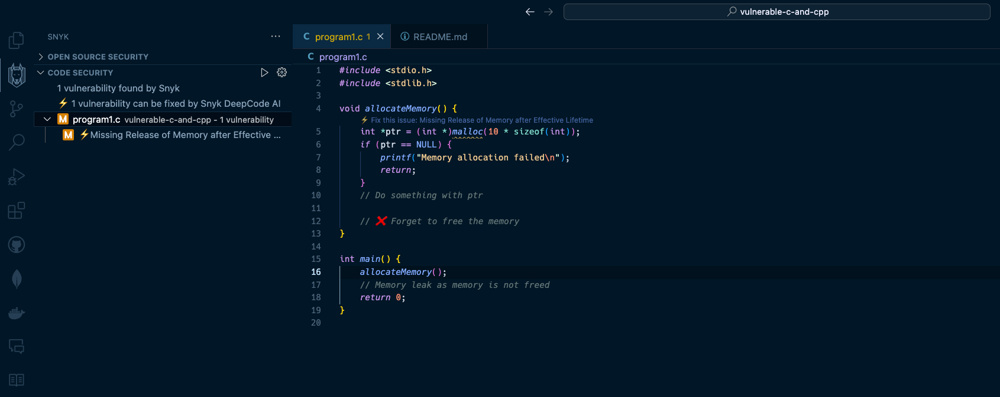
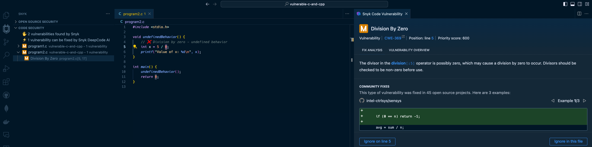

## Program 1

The `program1.c` file contains an example of Dynamic Memory Allocation Vulnerability (MISRA Dir 4.12, MISRA Rule 21.3).

The function `allocateMemory` uses `malloc` to allocate memory but does not free it, leading to a memory leak. This can be prevented by following MISRA guidelines that restrict dynamic memory allocation.

Run the program by compiling first and then executing it:

```bash
$ gcc program1.c -o program1.app
$ ./program1.app
```

Is there a memory leak in the program? How can you fix it?

### Find the vulnerability with Valgrind

Valgrind is a powerful tool that can help you find memory leaks in your program. We can run the program with Valgrind to see if there are any memory leaks.

Install Valgrind on your system. If you use a Linux-based system, you can install it using the package manager. Here's Debian-based example:

```bash
sudo apt-get install valgrind
```

Note: If you're on macOS and using ARM-based chips, support for Valgrind is not available so we'll skip it and run Valgrind from within a Docker container:

```bash
docker build -t "valgrind" . -f Dockerfile
```

Then run the container and map our current directory to the container's `/tmp` directory:

```bash
docker run -it -v $PWD:/tmp -w /tmp valgrind
```

Then compile the `program1.c` program within the container:

```bash
gcc program1.c -o program1.app
```

We can then run the program with Valgrind to check for memory leaks:

```bash
valgrind --leak-check=full ./program1.app
```

Then you should see the output from Valgrind that shows the memory leak:

```bash
/tmp # valgrind --leak-check=full ./program1.app
==29== Memcheck, a memory error detector
==29== Copyright (C) 2002-2024, and GNU GPL'd, by Julian Seward et al.
==29== Using Valgrind-3.23.0 and LibVEX; rerun with -h for copyright info
==29== Command: ./program1
==29==
==29==
==29== HEAP SUMMARY:
==29==     in use at exit: 40 bytes in 1 blocks
==29==   total heap usage: 1 allocs, 0 frees, 40 bytes allocated
==29==
==29== 40 bytes in 1 blocks are definitely lost in loss record 1 of 1
==29==    at 0x48E978C: malloc (in /usr/libexec/valgrind/vgpreload_memcheck-arm64-linux.so)
==29==    by 0x108823: allocateMemory (in /tmp/program1)
==29==    by 0x108857: main (in /tmp/program1)
==29==
==29== LEAK SUMMARY:
==29==    definitely lost: 40 bytes in 1 blocks
==29==    indirectly lost: 0 bytes in 0 blocks
==29==      possibly lost: 0 bytes in 0 blocks
==29==    still reachable: 0 bytes in 0 blocks
==29==         suppressed: 0 bytes in 0 blocks
==29==
==29== For lists of detected and suppressed errors, rerun with: -s
==29== ERROR SUMMARY: 1 errors from 1 contexts (suppressed: 0 from 0)
```

### Find the vulnerability with Snyk Code

Snyk Code will help you identify this vulnerability in your codebase, without even going through the compilation process. Just installing the extension and opening the file will show you the vulnerability because Snyk Code is a static code analysis tool that applies machine learning techniques to identify static code that doesn't require a build and compilation step and this approach enables reliable, low false-positive and fast feedback loop when Snyk scans your code for security vulnerabilities.



## Program 2

The `program2.c` file contains an example of Undesired Behavior (MISRA Rule 1.3)

Here's the program code:

```c
#include <stdio.h>

void undefinedBehavior() {
    int x = 5 / 0;
    printf("Value of x: %d\n", x);
}

int main() {
    undefinedBehavior();
    return 0;
}
```

Division by zero is an undefined behavior in C, which can lead to unpredictable results and MISRA guidelines, rightfully so, prohibit such operations to ensure code safety and security in critical software.

Run the program by compiling first and then executing it:

```bash
$ gcc program2.c -o program2.app
$ ./program2.app
```

You'll notice that the GCC compiler will throw a warning about division by zero:

```bash
program2.c:5:15: warning: division by zero is undefined [-Wdivision-by-zero]
    int x = 5 / 0;
              ^ ~
1 warning generated.
```

However, this is a simple and small program code. In real-world scenarios, such issues can be hard to find across a large codebase and many compiler warnings piped to standard output.

### Find the vulnerability with Snyk Code

Seeing the undefined behavior error message from a compiler warning about _division by zero_ and other issues can be hard to spot and late in the development cycle. Snyk Code can help you identify such issues early in the development cycle by scanning your codebase for such vulnerabilities before you even compile the code.

The reason for that is that Snyk employed machine learning techniques in its static code application security engine that can understand program call flows and connect sink-to-source code path flows to unearth insecure code and potential vulnerabilities in your codebase without even compiling the code.



## Program 3

The `program3.c` file contains several example, let's exploit them to demonstrate the different issues.

Once the program is compiled, you can run it:

```bash
$ ./program3.app "text.txt"
```

Given that you have a file in the same directory named `text.txt` and it is not empty, the program will read the file and print its contents.

For example:

```bash
Size of the file: 44
Contents of the file: FROM alpine:latest
RUN apk add g++ valgrind
```

Looks ok. What happens if you pass a file that traverses the directory structure?

```bash
$ ./program3.app "../../../../../etc/passwd"
```

A path traversal vulnerability is present in the program, allowing an attacker to read sensitive files on the system.

To test other vulnerabilities, try to:

- Pass a file that does not exist
- Pass a file that is empty
- Pass a file name or full path that is too large (more than 50 characters)
